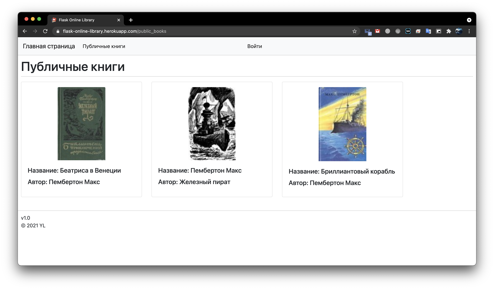

# Техническое задание
## Введение
Для реализации проекта по WEB выбран проект реализации онлайн библиотеки под названием "Flask Online Library". Незарегистрированные пользователи могут просматривать публичные книги и получать информацию о них через api. Зарегистрированные пользователи могут просматривать публичные и приватные книги и получать информацию о них через api, приватные книги можно получить с помощью api ключа, который можно получить на сайте, а также скачивать книги через сайт. Администратор может просматривать, добалять, редактировать, удалять публичные и приватные книги, также он имеет функционал зарегистрированного пользователя.
## Назначение
Проект "Flask Online Library" предназначен для хранения книг, информации о ней, например названия, автора, с возможностью скачивания книг. Проект может быть применен в научных журналах, вузах, школах с целью публикации книг, методичек, статей.
## Цель
Реализовать веб-приложение "Flask Online Library", использующее базу данных, с использованием фреймворка Flask с разворачиванием веб-приложения на облачной платформе heroku.
## Задачи
1. Реализовать создание flask приложения
2. Реализовать настройку flask приложения общим конфигом
3. Реализовать настройку flask приложения локальным конфигом, в котором определить настройки для flask-mail, flask-user, sqlalchemy
4. Реализовать настройку базы данных, в локальных настройках определить использование posgresql для heroku и sqlite для локального развертывания
5. Реализовать настройку миграций flask-migrate, настроить alembic 
6. Реализовать настройку flask-mail, в локальном конфиге проверить настройки для flask-mail
7. Реализовать настройку flask-resful, добавить заглушки ресурсов для получения информации о всех книгах, определенной книге, добавить эти ресурсы в api
8. Реализовать настройку CSRFProtect
9. Реализовать регистрацию blueprints, один эскиз отвечает за книги, другой за остальное взаимодействие
10. Реализовать настройку логов для email ошибок
11. Реализовать настройку flask-user, в локальном конфиге проверить настройки для flask-user
12. Реализовать настройку flask-script для взаимодействия с бд и запуском приложения через менеджер
13. Реализовать макет общего вида веб приложения, подключение bootstrap
14. Реализовать модель User, Role, UsersRoles, форм для  редактирования информации о пользователе (имени, фамилии), форму для генерирования api ключа
15. Реализовать модель книги, форм для добавления книги, редактирования книги
16. Реализовать команду инициализации бд
17. Реализовать main blueprint с обработкой запросов по пустому пути, иконки приложения, профиля пользователя, получения api ключа, реализовать обработчики ошибок приложения
18. Реализовать шаблоны для main эскиза, добавить пути к страницам в главный макет
19. Реализовать book blueprint с обработкой запросов получения публичных книг, приватных книг, станицы управления книгами, скачивания книги, добавления книги, редактирования книги, удаления книги
20. Реализовать шаблоны для book эскиза, добавить пути к страницам в главный макет
21. Реализовать тесты для страниц входа, выхода, работы проверки на роль, зарегистрированность пользователя
22. Реализовать ресурсы для получения информации о всех книгах, определенной книге, BooksRes и BookRes соответственно, реализовать проверку на наличие api ключа в запросе
23. Подготовить проект к развертыванию проекта на heroku, развернуть проект на heroku


## Требования к проекту
1. Проект должен реализовывать создание flask приложения
2. Проект должен реализовывать настройку flask приложения общим конфигом
3. Проект должен реализовывать настройку flask приложения локальным конфигом, в котором определять настройки для flask-mail, flask-user, sqlalchemy
4. Проект должен реализовывать настройку базы данных, в локальных настройках определять использование posgresql для heroku и sqlite для локального развертывания
5. Проект должен реализовывать настройку миграций flask-migrate, настроить alembic 
6. Проект должен реализовывать настройку flask-mail
7. Проект должен реализовывать настройку flask-resful
8. Проект должен реализовывать настройку CSRFProtect
9. Проект должен реализовывать регистрацию blueprints, один эскиз отвечать за книги, другой за остальное взаимодействие
10. Проект должен реализовывать настройку логов для email ошибок
11. Проект должен реализовывать настройку flask-user
12. Проект должен реализовывать настройку flask-script для взаимодействия с бд и запуска приложения через менеджер
13. Проект должен реализовывать макет общего вида веб приложения, использовать bootstrap
14. Проект должен реализовывать модель User, Role, UsersRoles, форм для  редактирования информации о пользователе (имени, фамилии), форму для генерирования api ключа
15. Проект должен реализовывать модель книги, форм для добавления книги, редактирования книги
16. Проект должен реализовывать команду инициализации бд
17. Проект должен реализовывать main blueprint с обработкой запросов по пустому пути, иконки приложения, профиля пользователя, получения api ключа, реализовывать обработчики ошибок приложения
18. Проект должен реализовывать шаблоны для main эскиза
19. Проект должен реализовывать book blueprint с обработкой запросов получения публичных книг, приватных книг, станицы управления книгами, скачивания книги, добавления книги, редактирования книги, удаления книги
20. Проект должен реализовывать шаблоны для book эскиза
21. Проект должен реализовывать тесты для страниц входа, выхода, работы проверки на роль, зарегистрированность пользователя
22. Проект должен реализовывать ресурсы для получения информации о всех книгах, определенной книге, BooksRes и BookRes соответсвенно, реализовывать проверку на наличие api ключа в запросе
23. Проект должен быть развернуть на heroku

## Используемые технологии
1. Библиотека flask
2. Библиотека flask-user
3. Библиотека flask-migrate
4. Библиотека alembic
5. Библиотека Flask-Mail
6. Библиотека Flask-RESTful
7. Библиотека Flask-Script
8. Библиотека Flask-SQLAlchemy
9. Библиотека Flask-WTF
10. Библиотека gunicorn
11. База данных sqlite / postgresql

# Запуск проекта
## Запуск без использования исходников
Для запуска веб-приложения перейдите на https://flask-online-library.herokuapp.com/
## Запуск с использованием исходников
### Установка всех необходимых зависимостей
Пропишите в терминале в PyCharm или в любой консоли в корне проекта ```pip install -r requirements.txt```
### Инициализация базы данных
Пропишите в терминале в PyCharm или в любой консоли в корне проекта ```python manage.py init_db```
### Запуск
Пропишите в терминале в PyCharm или в любой консоли в корне проекта ```python manage.py runserver``` и перейдите по адресу в браузере http://127.0.0.1:5000/ 

# Инструкция по использованию
Для использования сайта вам необходимо запустить проект по инструкции выше, далее вы можете использовать сайт в соответсвии с приведенными ниже сценариями использования.
## Сценарии использования
### 1. Получение информации об опубликованных на сайте публичных книгах для неавторизованных пользователей
1. Перейдите по [ссылке](https://flask-online-library.herokuapp.com/), вы увидите описание возможностей сайта

2. 
    * Перейдите по ссылке в шапке сайта ```Публичные книги``` или по [ссылке](https://flask-online-library.herokuapp.com/public_books). Вам отображаются публичные книги, которые доступны для скачивания на сайте после авторизации.
    
    * Также можно получить список публичных книг через api в формате json посредством http запроса по адресу [/api/books](https://flask-online-library.herokuapp.com/api/books) (картинка отображается в base64, не бейте пожалуйста) )
    
    * Также можно получить информацию о публичной книге с конкретным id, допустим с id = 6 (смотрите в список книг перед запросом,
    т.к. книги с таким id может быть не существовать или она приватная), через api в формате json посредством http запроса по адресу [/api/books/6](https://flask-online-library.herokuapp.com/api/books/6) (картинка отображается в base64, не бейте пожалуйста) )
    
### 2. Получение информации об опубликованных на сайте публичных и приватных книгах и скачивание книги для авторизованных пользователей
1. Перейдите по [ссылке](https://flask-online-library.herokuapp.com/), вы увидите описание возможностей сайта

2. Перейдите на страницу авторизации по ссылке в шапке сайта ```Войти``` или по [ссылке](https://flask-online-library.herokuapp.com/user/sign-in). Вам отображается страница авторизации, вы можете воспользоваться уже готовым аккаунтом обычного пользователя с логином ```member@example.com``` и паролем ```Password1``` (пожалуйста не меняйте пароль, чтобы другие коллеги также смогли проверить работу без излишних действий) и переходить к ```4``` пункту данного сценария использования или зарегистрироваться, для этого переходите к следующему пункту.

3. Перейдите на страницу регистрации по ссылке ```New here? Register.``` или по [ссылке](https://flask-online-library.herokuapp.com/user/register). Вам будет представлена форма регистрации, вам нужно будет ввести почту, пароль и подтверждение пароля.

Для почты можете использовать временную почту, например с сервиса https://temp-mail.org/en/ или любую другую. Данный сервис сгенерировал почту ```poxir41186@zcai77.com```. Вводите адрес почты, пароль, например ```Password1``` и подтверждение пароля.

Далее нажмите на кнопку ```Register```. Вам высветится сообщение о том, что вам отправлено письмо для подтверждения почты. Внимание, нужно подтвердить почту для входа на сайт.

Подтверждаете почту в сообщении на почте.

Вас переадресует на сайт и вы автоматически войдете на сайт под своими логином и паролем.

    * Вы можете изменить пароль, добавить или изменить ваше имя, фамилию в профиле пользователя, для того чтобы зайти на страницу пользователя нажмите на email в шапке сайта.

4. 
    * Перейдите по ссылке в шапке сайта ```Публичные книги``` или по [ссылке](https://flask-online-library.herokuapp.com/public_books). Вам отображаются публичные книги, вы можете скачать книгу нажав на кнопку ```Скачать```.
    
    * Также можно получить список публичных книг через api в формате json посредством http запроса по адресу [/api/books](https://flask-online-library.herokuapp.com/api/books) (картинка отображается в base64, не бейте пожалуйста) )
    
    * Также можно получить информацию о публичной книге с конкретным id, допустим с id = 6 (смотрите в список книг перед запросом,
    т.к. книги с таким id может быть не существовать или она приватная), через api в формате json посредством http запроса по адресу [/api/books/6](https://flask-online-library.herokuapp.com/api/books/6) (картинка отображается в base64, не бейте пожалуйста) )
    
5. 
    * Перейдите по ссылке в шапке сайта ```Приватные книги``` или по [ссылке](https://flask-online-library.herokuapp.com/private_books). Вам отображаются приватные книги, вы можете скачать книгу нажав на кнопку ```Скачать```.
    
    * Для доступа к приватным книгам через api вам необходим api ключ, который вы можете сгенерировать себе на [странице](https://flask-online-library.herokuapp.com/main/get_api_key) или нажать в шапке сайта ```Получить api ключ```, далее по нажатии на кнопку на странице ```Получить новый api ключ``` вам сгенерируется api ключ, его вы можете использовать для получения информации о приватных и публичных книгах.
    
    * Теперь можно получить список публичных и приватных книг через api в формате json посредством http запроса, используя api ключ, по адресу [/api/books?api_key=Z4f7d7lIofy0qwc3eZA9OnkOMsY](https://flask-online-library.herokuapp.com/api/books?api_key=Z4f7d7lIofy0qwc3eZA9OnkOMsY) (картинка отображается в base64, не бейте пожалуйста) )
    
    * Также можно получить информацию о приватной или публичной книге с конкретным id, допустим с id = 4 (смотрите в список книг перед запросом,
    т.к. книги с таким id может быть не существовать), через api в формате json посредством http запроса, используя api ключ, по адресу  [/api/books/4?api_key=Z4f7d7lIofy0qwc3eZA9OnkOMsY](https://flask-online-library.herokuapp.com/api/books/4?api_key=Z4f7d7lIofy0qwc3eZA9OnkOMsY) (картинка отображается в base64, не бейте пожалуйста) )
    
### 3. Добавление, просмотр, редактирование, удаление публичных и приватных книг с использованием аккаунта администратора
1. Перейдите на страницу авторизации по ссылке в шапке сайта ```Войти``` или по [ссылке](https://flask-online-library.herokuapp.com/user/sign-in). Вам отображается страница авторизации, вам нужно воспользоваться уже готовым аккаунтом с логином ```admin@example.com``` и паролем ```Password1``` (пожалуйста не меняйте пароль, чтобы другие коллеги также смогли проверить работу без излишних действий)
2. Перейдите по ссылке в шапке сайта ```Добавить книгу``` или по [ссылке](https://flask-online-library.herokuapp.com/add_book). Вам отобразится форма для добавления книги, вам обязательно нужно заполнить название, автора, добавить картинку, принимается в расширениях .jpg, .jpeg, .png, добавить файл, принимается в расширениях .fb2, .pdf, .epub, .aep, .mobi, .azw3 размером до 30 мб. Далее нужно нажать на кнопку ```Добавить```, вас отправит на главную страницу. Можете перейти на страницу с публичными книгами, в данном случае, и увидеть добавленную книгу.


3. Перейдите по ссылке в шапке сайта ```Страница администрирования книг``` или по [ссылке](https://flask-online-library.herokuapp.com/manage_books). Вам отобразятся все публичные и приватные книги, для редактирования книги нажмите на соответсвующей карточке кнопку ```Изменить```.

4. Измените картинку, по нажатию на поле с именем картинки, или любое другое поле и нажмите на кнопку ```Изменить```.


5. Удалите созданную, редактированную вами книгу для тестирования работы удаления книги из книг по нажатию кнопки ```Удалить``` соответсвующей книги на странице ```Страница администрирования книг```.

